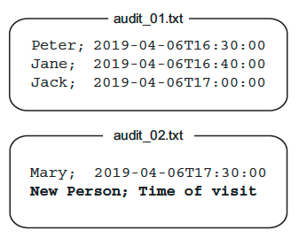

https://sammancoaching.org/kata_descriptions/audit.html

The Audit project is an audit system that keeps track of all visitors in an organization. 

* uses flat text files as underlying storage with the structure shown below
* system appends the visitor’s name and the time of their visit to the end of the most recent file
  * When the maximum number of entries per file is reached: a new file with an incremented index is created

This is actually a refactoring kata. 

The starting position is available on Github https://github.com/katalogs/audit-kata.

https://sammancoaching.org/learning_hours/test_design/styles_of_unit_tests.html